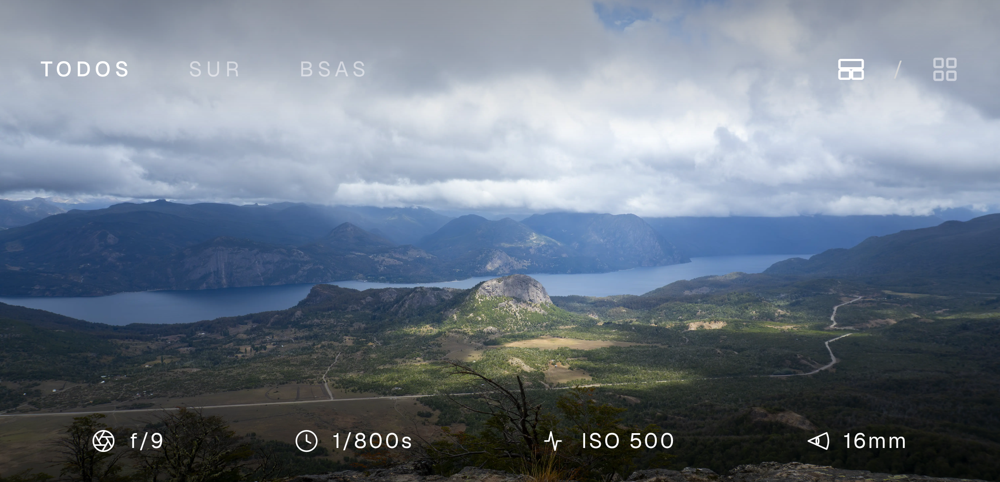

# Minimal Photography Portfolio

A cinematic, minimalist photography portfolio built with Next.js (App Router), TypeScript, and TailwindCSS V4. It features a sleek black background, seamless flush image grids, and high-fidelity photo rendering.



## Setup Instructions

1. Install dependencies (we recommend pnpm as defined by the workspace lockfile, but npm/yarn work too):
   ```bash
   pnpm install
   ```
2. Start the development server:
   ```bash
   pnpm dev
   ```
3. Open [http://localhost:3000](http://localhost:3000) in your browser.

## Development Commands

- `pnpm dev`: Starts the development server.
- `pnpm build`: Builds the application for production.
- `pnpm start`: Runs the built production server.
- `pnpm lint`: Runs ESLint for code quality.

## Project Structure

```
├── app/
│   ├── components/
│   │   ├── CameraStats.tsx    # EXIF overlay (hover on tiles, always on in lightbox)
│   │   ├── Navbar.tsx         # Auto-hiding gradient navigation
│   │   ├── PhotoCard.tsx      # Grid tile; optimizer + optional lightbox + prefetch
│   │   ├── PhotoGrid.tsx      # 3-column grid; tile click reports to parent for URL update
│   │   ├── PhotoLightbox.tsx  # Full-screen modal (portal); underlay + full-res + close
│   │   ├── PhotoShowroom.tsx  # Cinematic layout (2:1 horizontal, 4:5 vertical md+)
│   │   └── ViewModeSwitch.tsx # Toggle between Grid and Showroom
│   ├── lib/
│   │   ├── photoSlug.ts       # URL slug helpers for `photo` query + category alignment
│   │   └── prefetchImage.ts   # Deduped hover/lightbox prefetch into HTTP cache
│   ├── constants.ts           # Photos DB, `GRID_IMAGE_SIZES`, category types
│   ├── globals.css            # Tailwind V4, fade-in, hidden scrollbars
│   ├── layout.tsx             # Root layout
│   └── page.tsx               # URL-driven UI (`Suspense` + `useSearchParams`), lightbox, "fin"
```

## How to Add New Photos/Categories

All photography data is highly normalized and managed in `app/constants.ts`.

To add a photo, edit the `photos` object and place it inside the desired category array. Each entry needs `url` (full-size, used in showroom and lightbox), **`urlLowQuality`** (smaller asset for the grid), `orientation` (`"horizontal"` | `"vertical"`), and a `camera` object for EXIF overlays.

```typescript
export const photos = {
  sur: [
    {
      url: 'https://your-cdn.com/image.webp',
      urlLowQuality: 'https://your-cdn.com/image-sm.webp',
      orientation: 'horizontal',
      camera: {
        iso: 400,
        aperture: 'f/8',
        shutterSpeed: '1/250s',
        focalLength: '35mm',
      },
    },
  ],
  norte: [/* ... */],
}
```

**Note on the "todos" category:**
You do _not_ need to maintain a separate "todos" array or include a `category` property. The `Navbar` automatically detects all category keys inside `constants.ts` and aggregates them into the "todos" tab in real time.

## URLs and deep links

UI state is reflected in the query string (defaults are omitted for a clean `/`):

| Query param | Meaning                                                                     | If omitted           |
| ----------- | --------------------------------------------------------------------------- | -------------------- |
| `category`  | `todos` or any key of `photos` in `constants.ts`                            | `todos` (all photos) |
| `view`      | `showroom` or `grid`                                                        | `showroom`           |
| `photo`     | Filename / last segment of the photo’s full `url` (URL-encoded when needed) | No lightbox          |

Examples: `/?view=grid`, `/?category=sur&view=grid&photo=PIC03277.webp`. Opening a link with `photo` in a new tab opens the lightbox after hydration; invalid slugs are stripped from the URL.

## Image optimization and grid lightbox

**Showroom** and **lightbox** `<Image />` use **`unoptimized`** so full `url` WEBPs are served as-is from R2.

**Grid** thumbnails use `urlLowQuality` through Next’s Image Optimization (`quality={75}` in `PhotoCard`). The **`sizes`** attribute comes from **`GRID_IMAGE_SIZES`** in `app/constants.ts`—edit that string to calibrate thumbnail resolution (the last `px` value on large viewports is the main sharpness vs. bandwidth knob). `next.config.ts` defines `images.qualities` and `images.remotePatterns` for R2.

**Prefetch:** Hovering or focusing a grid tile (and opening the lightbox) uses `app/lib/prefetchImage.ts` so repeated interactions share one in-flight fetch per URL when possible. Strong **`Cache-Control`** on R2 still improves cache hits.

**Grid mode:** Click a tile to open a full-screen lightbox (the address bar gains a `photo` query; browser Back dismisses without leaving the site). A low-res underlay appears immediately; full resolution fades in when ready. Escape, backdrop, or X closes the modal (URL updates via `replace`). The lightbox is portaled to `document.body` after mount so it is not clipped by CSS `transform` on the page and SSR stays valid.

**Scrollbars:** `globals.css` hides native scrollbars on `html` and `body` while keeping scroll behavior, which avoids layout shift when the lightbox toggles `overflow: hidden` on `body`.

## Deployment Instructions

This project is optimized for deployment on Vercel.

1. Push your code to a Git repository (GitHub, GitLab, BitBucket).
2. Import the project in Vercel.
3. Vercel will automatically detect Next.js and apply the correct build settings (`next build`).
4. Click Deploy.
